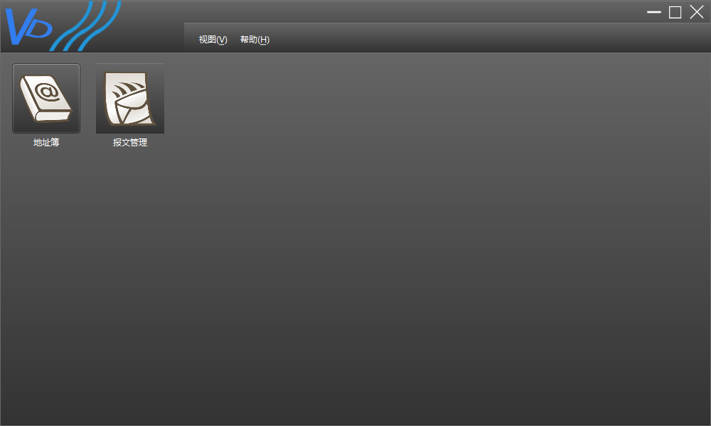
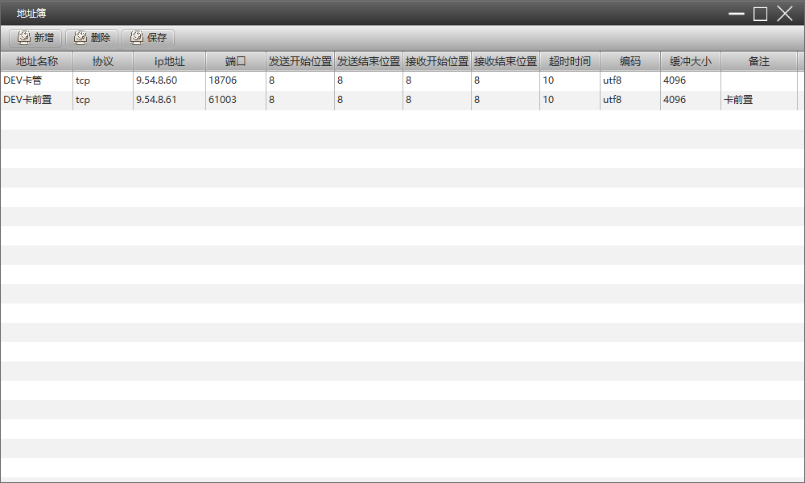
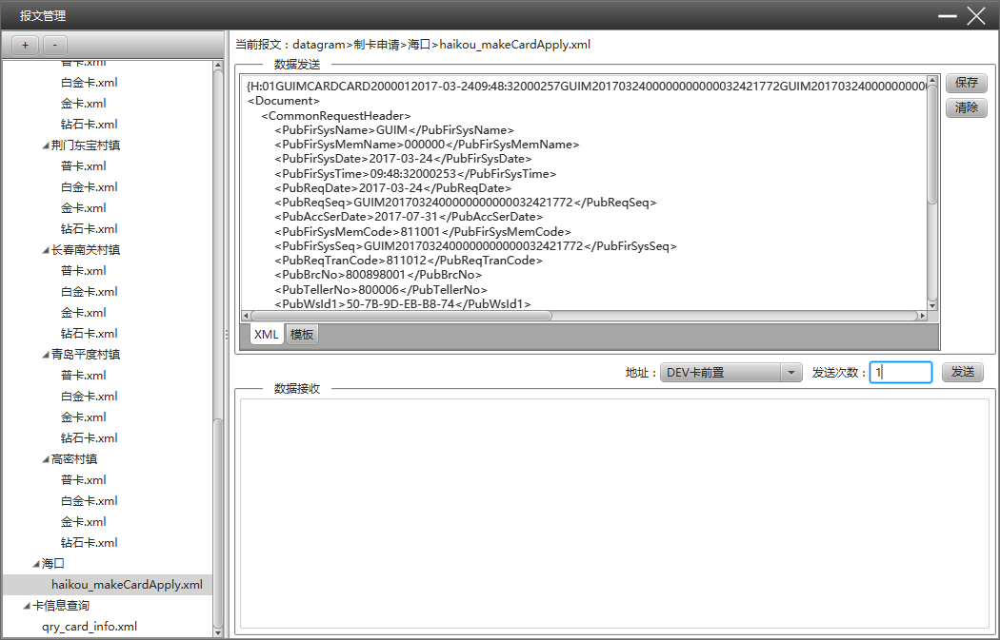

## 报文管理发送工具VD

>   VD（Virtual Datagram Manager），他能够报文案例文件进行有效有组织的进行管理，并且很容易的实现对不同的地址进行报文发送。
>   无论你是用来管理一大批的测试报文案例，还是用来暂时的发送报文，他都是你的一个很好的选择。
>   另外良好的界面设计架构也方便从上面继续新的功能开发。

###功能模块：###
* 模块功能管理
* 地址簿管理
* 报文管理
* 报文发送与接收

---------------------

###效果图###

__VD主界面__

__地址簿__

__报文管理__

---------------------

###文件说明：###

**conf:** 存放系统的一些配置文件。
*    log4j.properties 配置log4j日志
*    system.properties 系统参数配置
*    ui.properties ui资源配置

**data:** 存放系统数据目录
*   datagram 存放系统报文数据
*   address.ini 地址簿数据
*   userConfig.ini 用户个性化数据

**logs:** 存放系统日志
*   error.log 系统错误日志
*   system.log 系统平台错误日志
*   system.out 系统输出日志
*   vdlog.log  系统一般行为日志

**resources/lang** 存放系统国际化资源文件
*   vdLang.properties 默认资源文件
*   vdLang_en_US.properties en_US资源文件
*   vdLang_zh_CN.properties zh_CN资源文件

**resources/ui**
*   addressBook.fxml 地址簿的javafx的fxml布局控制文件；
*   datagramMana.fxml 报文管理的javafx的fxml布局控制文件；
*   datagramAdd.fxml 新增报文的javafx的fxml布局控制文件；
*   vd.fxml VD主窗口的javafx的fxml布局控制文件；
*   vdAbout.fxml 关于对话框的javafx的fxml布局控制文件；

**resources/ui/skin**
* 下面文件都是皮肤的具体定义css样式，默认皮肤有CASPIAN和modena两种

**src**
* 下面是VD的java程序实现

---------------------